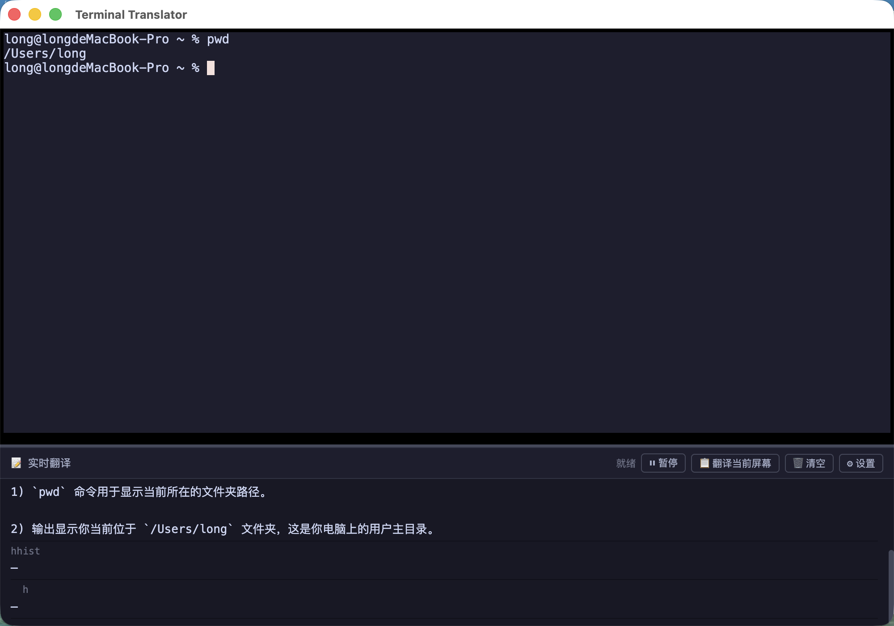
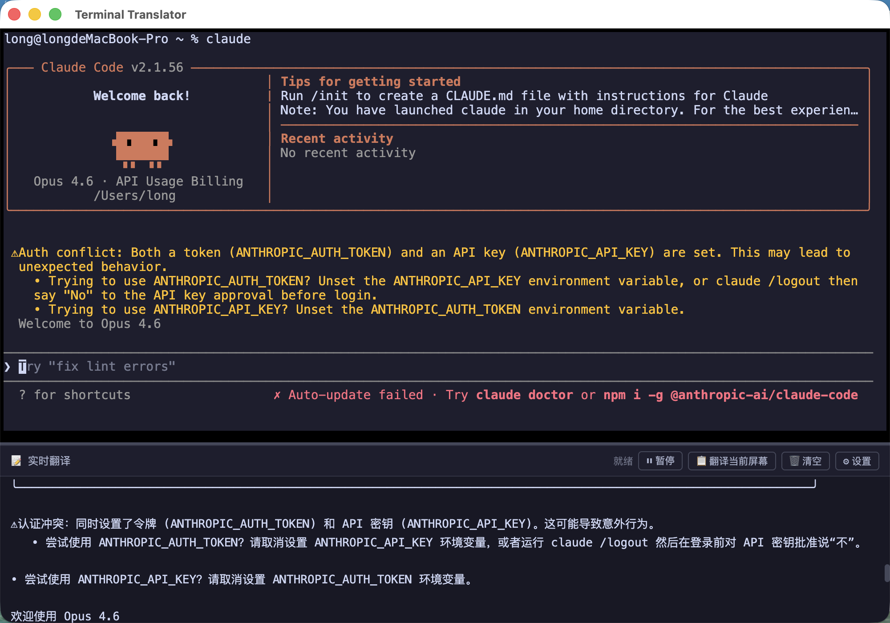
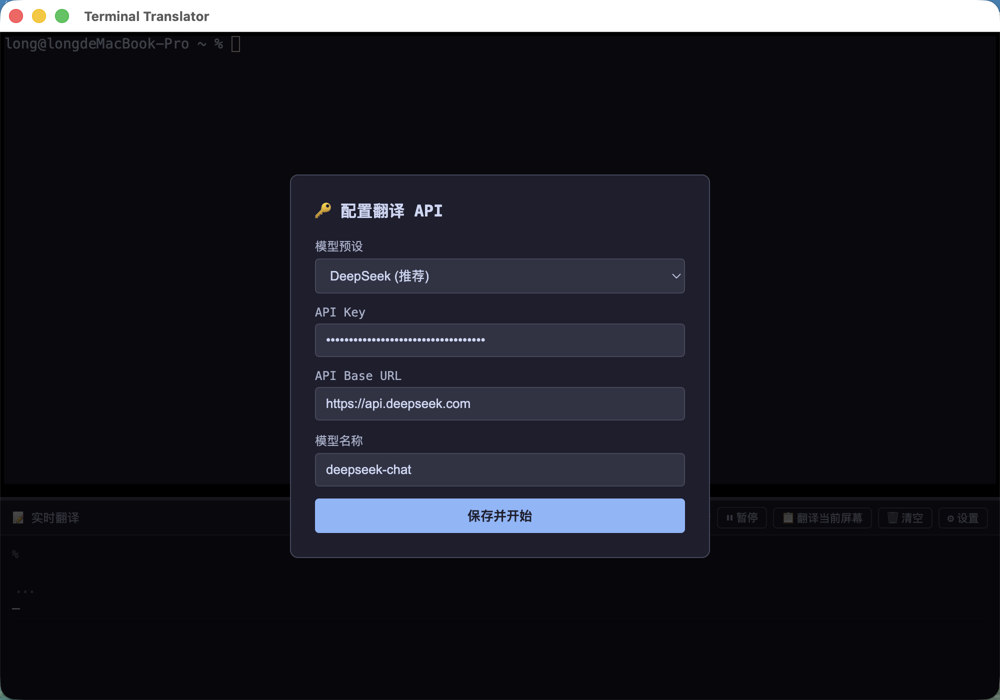
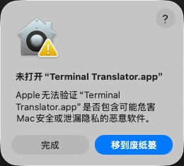

# Terminal Translator 🌐

命令行实时翻译助手 — 终端输出实时翻译成中文，编程小白也能看懂。

  

## 📸 截图

### 实时翻译终端输出


### 支持 Claude Code 等复杂场景


### 多模型配置


## ✨ 功能

- **实时翻译** — 终端英文输出自动翻译成中文
- **智能识别** — 自动跳过代码内容，只翻译有意义的文本
- **命令解释** — 对 `ls`、`pwd` 等基础命令附带通俗解释，小白友好
- **翻译当前屏幕** — 一键翻译当前终端可见内容
- **多模型支持** — DeepSeek / OpenAI / Kimi / 通义千问 / Ollama
- **分屏设计** — 上半部分真实终端，下半部分翻译面板
- **可拖动分隔条** — 自由调整终端和翻译面板的比例
- **暂停/恢复** — 随时暂停翻译，不浪费 API 调用
- **友好报错** — API 错误会用中文解释原因和解决方法

## 🚀 快速开始

### 方式一：下载安装包（推荐小白用户）

1. 前往 [Releases](https://github.com/460065581-star/terminal-translator/releases) 页面
2. 下载最新的 `.dmg` 文件
3. 双击打开 `.dmg` 文件
4. 将 `Terminal Translator.app` 拖入 `Applications` 文件夹
5. 按照下方「⚠️ 首次打开设置」完成安全设置

---

### ⚠️ 首次打开设置（重要！）

由于这是个人开发的应用，没有 Apple 官方签名，macOS 会阻止首次打开。请按以下步骤操作：

#### 第一步：尝试打开应用

1. 打开 **访达（Finder）**
2. 点击左侧的 **「应用程序」**（或按 `Command + Shift + A`）
3. 找到 **Terminal Translator** 应用
4. **双击打开**
5. 会弹出如下提示框：



6. 点击 **「完成」** 关闭这个弹窗（先不要点「移到废纸篓」！）

#### 第二步：打开系统设置

1. 点击屏幕左上角的 **苹果图标 ** 
2. 点击 **「系统设置...」**（如果是旧版 macOS，叫「系统偏好设置」）

#### 第三步：找到隐私与安全性

1. 在系统设置窗口左侧，向下滚动
2. 找到并点击 **「隐私与安全性」**

#### 第四步：允许打开应用

1. 在右侧页面向下滚动，找到 **「安全性」** 部分
2. 你会看到一条提示：**「已阻止 "Terminal Translator.app"，因为它不是从 App Store 下载的」**
3. 点击旁边的 **「仍要打开」** 按钮
4. 系统会要求你输入 **电脑密码**（就是你开机时输入的密码）
5. 输入密码后点击 **「解锁」** 或 **「修改设置」**

#### 第五步：确认打开

1. 会再次弹出确认框：「macOS 无法验证此 App 的开发者...」
2. 点击 **「打开」**
3. 🎉 应用成功启动！

> 💡 **提示**：这个设置只需要做一次。之后就可以正常双击打开了。

---

### 方式二：从源码安装（开发者）

#### 前置要求

- macOS 10.15+
- [Node.js](https://nodejs.org) >= 18
- Xcode Command Line Tools (`xcode-select --install`)

#### 一键安装

```bash
git clone https://github.com/460065581-star/terminal-translator.git
cd terminal-translator
bash setup.sh
```

#### 启动

```bash
npm start
```

首次启动会弹出配置窗口，选择模型并填入 API Key 即可。

## 🔧 支持的模型

| 模型 | API Base | 需要 Key |
|------|----------|----------|
| DeepSeek (推荐) | `https://api.deepseek.com` | ✅ |
| OpenAI | `https://api.openai.com` | ✅ |
| Kimi (月之暗面) | `https://api.moonshot.cn` | ✅ |
| 通义千问 | `https://dashscope.aliyuncs.com/compatible-mode` | ✅ |
| Ollama (本地) | `http://localhost:11434` | ❌ |
| 自定义 | 任意 OpenAI 兼容 API | 视情况 |

> 💡 API Key 按模型分别保存，切换模型时自动恢复之前的配置。

### 使用 Ollama (免费本地模型)

```bash
# 安装 Ollama
brew install ollama

# 下载模型
ollama pull qwen2.5:7b

# 启动后在 Terminal Translator 中选择 Ollama 预设即可
```

## 🧠 智能翻译

翻译器会自动识别终端输出类型：

- **代码** (HTML/JS/Python 等) → 跳过翻译，显示 "📝 代码内容，跳过翻译"
- **命令输出** (`ls`、`pwd` 等) → 翻译 + 通俗解释
- **普通文本** (错误信息、日志等) → 正常翻译
- **Claude Code 写文件** → 自动跳过代码部分，翻译对话部分

## 📁 项目结构

```
terminal-translator/
├── main.js          # Electron 主进程
├── preload.js       # 预加载脚本 (IPC 桥接)
├── index.html       # 界面
├── renderer.js      # 渲染进程 (翻译逻辑)
├── setup.sh         # 一键安装脚本
├── screenshots/     # 截图
└── package.json
```

## ⚙️ 配置

点击翻译面板右上角的 **设置** 按钮可以随时修改 API 配置。

配置保存在本地，重启后自动恢复。

## 📄 License

MIT
